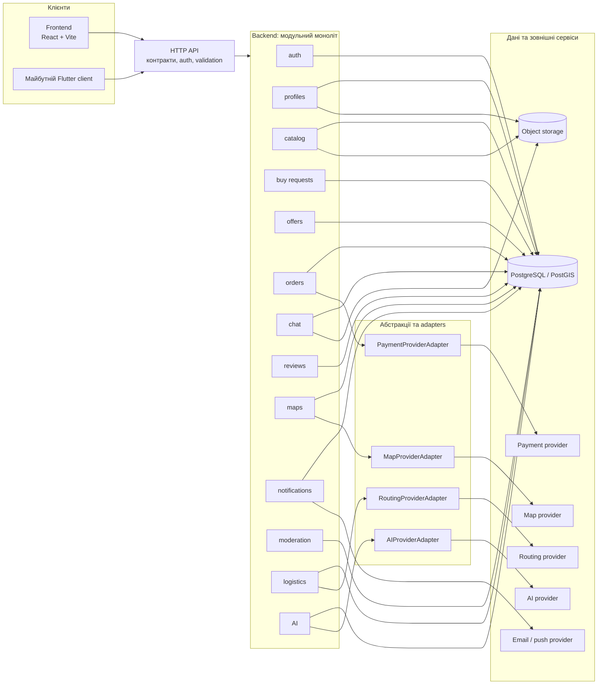

# Архітектура marketplace-navpaky

## Архітектурне рішення

На старті застосовується **модульний моноліт**: один backend-процес і один API, всередині якого функціональність розділена на модулі з чіткими межами. Мікросервіси не вводяться до появи доведених причин для окремого масштабування або незалежного розгортання.

Frontend та майбутній Flutter client працюють через той самий HTTP API. Клієнти не мають прямого доступу до бази даних, storage або зовнішніх провайдерів.

## Схема

## Межі шарів

### Frontend та Flutter client

- Відповідають за UI, навігацію, локальний стан і відображення даних.
- Викликають лише публічний HTTP API.
- Не містять бізнес-правил, які мають бути спільними для різних клієнтів.
- Flutter client використовує ті самі API-контракти, автентифікацію та правила доступу, що й web frontend.

### API

- Є єдиною точкою входу для клієнтів.
- Перевіряє автентифікацію, авторизацію, формат запитів і відповіді.
- Перетворює HTTP-запити на виклики backend-модулів.
- Не містить специфічної логіки окремого UI.

### Backend modules

Кожен модуль володіє своєю бізнес-логікою, use cases і межами даних. Модулі взаємодіють через внутрішні сервіси або події моноліту, а не через прямий доступ до чужих внутрішніх деталей.

- **auth** — облікові записи, сесії, токени, ролі та права доступу.
- **profiles** — профілі користувачів, контактні дані та налаштування.
- **catalog** — категорії, товари, оголошення, медіа та пошук.
- **buy requests** — запити покупців і їхні стани.
- **offers** — пропозиції продавців у відповідь на buy requests.
- **orders** — життєвий цикл замовлення, статуси та платежі через adapter.
- **chat** — діалоги, повідомлення та вкладення.
- **reviews** — оцінки й відгуки після завершених взаємодій.
- **maps** — геодані, точки, геозони та відображення карт через adapter.
- **notifications** — шаблони, налаштування та доставка сповіщень.
- **moderation** — скарги, перевірки контенту, блокування та рішення модерації.
- **logistics** — способи доставки, розрахунок маршруту й статуси через adapter.
- **AI** — узгоджені AI use cases через adapter; провайдер не є частиною доменної логіки.

### Database, storage та зовнішні сервіси

- **Database** — транзакційні дані модулів; базовий напрямок — PostgreSQL із PostGIS для геоданих.
- **Object storage** — зображення, вкладення та інші великі файли; у базі зберігаються метадані й посилання.
- **External services** — карти, платежі, маршрутизація, AI та канали сповіщень.
- Жоден зовнішній провайдер не викликається напряму з клієнта.

## Абстракції та adapters

Для інтеграцій, де провайдера можна замінити, backend залежить від власного інтерфейсу, а не від SDK конкретного сервісу:

- `MapProviderAdapter` — пошук місць, геокодування та map data.
- `PaymentProviderAdapter` — створення платежу, підтвердження та повернення коштів.
- `RoutingProviderAdapter` — відстань, час і побудова маршруту.
- `AIProviderAdapter` — доступ до погоджених AI-операцій.

Конкретні реалізації adapters ізолюють SDK, ключі, формат помилок і перетворення відповідей провайдера. Заміна провайдера не повинна змінювати API клієнтів або доменні модулі.

## Межі першого етапу

Цей документ описує цільову структуру та правила залежностей. Він не реалізує модулі, API-операції, схеми бази даних, інтеграції провайдерів або Flutter client.
