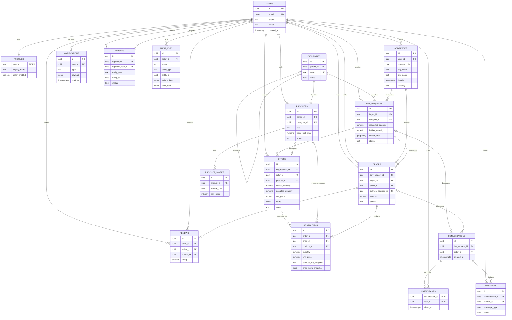

# ER diagram

Логічна ER-діаграма моделі PostgreSQL + PostGIS. Геометричні поля позначені як `geography`.

`offers.accepted_quantity` і зв'язок `buy_requests -> orders` моделюють часткове виконання одним або кількома продавцями. `order_items` містить snapshot істотних умов прийнятого offer.
